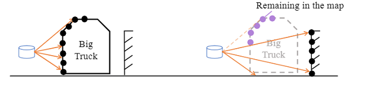

# FAST-LIO-WithoutDynObj

## 项目介绍

为了解决FAST-LIO在长直隧道环境下，由于动态物体的影响，导致其定位精度下降，进一步导致无法构建隧道点云地图的问题，本项目基于FAST-LIO开发，引入光路原理，能在复杂环境下实现动态物体点云识别及去除，但是目前仍存在部分不足，如：

 - 误识别率较高，对于雷达感知的末端点，由于其数据波动幅度较大，易被误认为动态点云
 - 无法完整识别出视野内所有动态点云，只对于近距离点云能有效识别
 - 识别结果不连续，对于近距离范围的点，不能保证每一帧都能准确识别，会存在偶尔几帧点云漏识别的情况

## 效果展示

本项目在长直隧道环境数据集下进行了测试，实验中隧道长度约150m，使用[绝影X30](https://www.deeprobotics.cn/robot/index/product3.html)作为设备平台，其上搭载[Livox Mid 360](https://www.livoxtech.com/cn/mid-360)，成功构建隧道点云[PCD](./PCD/scans_filtered.pcd)，其中红色点为动态物体点云特征点。

<div align="center">

</div>

## 算法原理

传统光路判断动态物体的方法是，假设雷达处于静止状态，其位置为 $p_{static}$，上一帧点云为 $f_{last}$，当前帧点云为 $f_{curr}$。则在静止的雷达位置下，做 $p_{static}$ 到点 $f_{last}$ 的线段（即光路），在当前帧下，以同样的光路射向点云 $f_{curr}$，如果光路距离增大，即射向 $f_{curr}$ 的光路穿过 $f_{last}$，则认为 $f_{last}$ 下被穿过的点为动态物体点。

由于该方法判断出动态物体点处于上一帧中，我们考虑将方法逻辑反转，并且忽略实际环境中雷达的运动，假设其位置为 $p_{dyn}$，做 $p_{dyn}$ 到 $f_{last}$ 的光路，若光路途中经过 $f_{curr}$，则认为这部分 $f_{curr}$ 的点为动态物体点。

同时，在隧道环境下，前后方超出雷达的探测范围，容易导致无法构建光路，所以在上一帧中缺少点云的位置构建虚拟点以补充光路终点。

<div align="center">

</div>


## 使用

### 配置环境

Ubuntu 20.04 ( ROS noetic )


### 运行
```
mkdir -p Fast_LIO_WithoutDynObj/src

cd Fast_LIO_WithoutDynObj/src

git clone git@github.com:LeeWhisper/FAST-LIO-WithoutDynObj.git

cd ..

catkin_make

roslaunch fast_lio mapping_mid360.launch
```

### 注意事项

修改配置参数：[mid360.yaml](./config/mid360.yaml)，特别是以下参数：

``` yaml
common:
    lid_topic:  "/livox/lidar"
    imu_topic:  "/imu/data"
```
